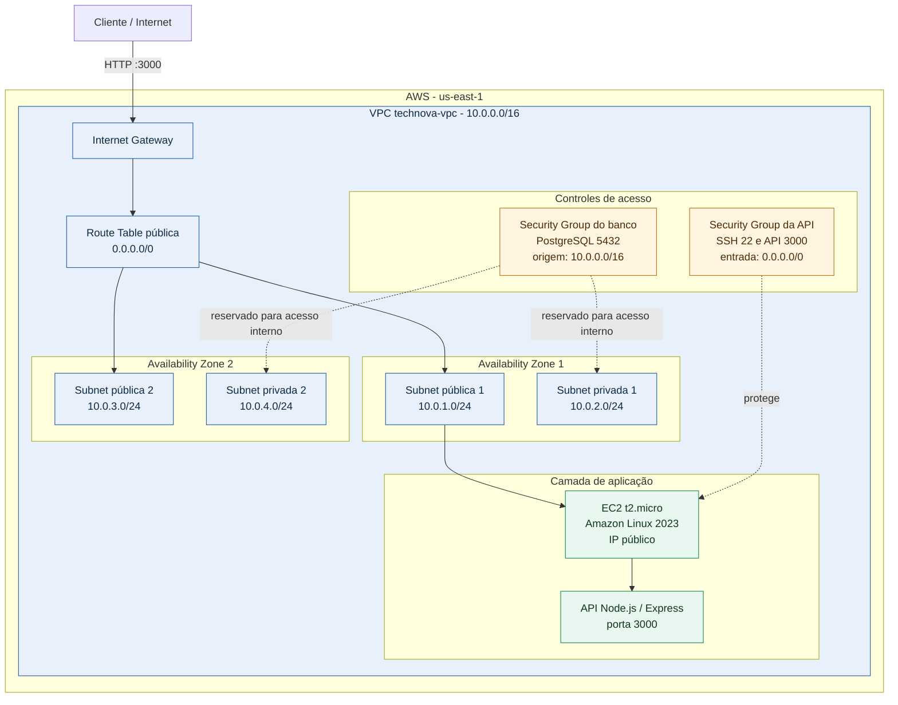

# TechNova

Infraestrutura da API TechNova provisionada na AWS com Terraform.

## Diagrama da arquitetura



## Componentes

| Camada | Recursos | Função |
| --- | --- | --- |
| Rede | VPC `10.0.0.0/16` | Rede isolada do projeto |
| Alta disponibilidade | 2 Availability Zones | Distribuição das sub-redes em duas zonas |
| Entrada pública | Internet Gateway e route table pública | Permite tráfego externo para as sub-redes públicas |
| Aplicação | EC2 `t2.micro` na subnet pública 1 | Executa a API Node.js |
| API | Express na porta `3000` | Endpoints `/`, `/health` e `/api/info` |
| Segurança | Security Groups da API e do banco | Controla SSH, HTTP da API e PostgreSQL interno |
| Acesso administrativo | Key Pair `technova-key` | Acesso SSH à EC2 |

## Inicialização da aplicação

O arquivo `user_data.sh` executado pela EC2:

1. Atualiza o Amazon Linux e instala Node.js e Git.
2. Clona o repositório da aplicação.
3. Instala as dependências com `npm install`.
4. Inicia a API com `npm start`.

## Endpoints

Depois do `terraform apply`, a URL é exibida pelo output `api_url`:

- `GET /` - status da API
- `GET /health` - health check
- `GET /api/info` - informações do projeto

Exemplo:

```text
http://<IP_PUBLICO_DA_EC2>:3000/health
```

## Terraform

```bash
terraform init
terraform plan
terraform apply
```

Outputs úteis:

- `ec2_public_ip`
- `api_url`
- `ssh_command`
- `vpc_id`
- `public_subnet_ids`
- `private_subnet_ids`

## Observação sobre o banco de dados

A configuração atual cria as sub-redes privadas e o security group que permite PostgreSQL na porta `5432` dentro da VPC, mas ainda não cria uma instância ou serviço de banco de dados. A camada privada está preparada para uma expansão futura.
